# 📥 Installation & Setup Guide

> A step-by-step walkthrough for installing and running the **Azure DevOps → GitHub Migration Pipeline**.
>
> This guide is transcribed from the two video walkthroughs in the [`media/`](./media) folder:
>
> | Video | Topic | Covered Below |
> |-------|-------|---------------|
> | **`media/part 1.mp4`** | Prerequisites & one-time setup | [Part 1](#part-1--prerequisites--one-time-setup) |
> | **`media/part 2.mp4`** | Running & understanding the pipeline | [Part 2](#part-2--running--understanding-the-pipeline) |
>
> For the full reference (PAT scopes, variable groups, stage internals, FAQ), see the main [README.md](./README.md).

---

## 📋 Table of Contents

- [Part 1 — Prerequisites & One-Time Setup](#part-1--prerequisites--one-time-setup)
  - [Step 1: Clone the pipeline repository](#step-1-clone-the-pipeline-repository)
  - [Step 2: Configure the CSV files](#step-2-configure-the-csv-files)
  - [Step 3: Confirm the GitHub Apps are installed](#step-3-confirm-the-github-apps-are-installed)
  - [Step 4: Create the GitHub service connection](#step-4-create-the-github-service-connection)
  - [Step 5: Authorize Azure Pipelines (OAuth)](#step-5-authorize-azure-pipelines-oauth)
  - [Step 6: Copy the service connection ID into `pipelines.csv`](#step-6-copy-the-service-connection-id-into-pipelinescsv)
- [Part 2 — Running & Understanding the Pipeline](#part-2--running--understanding-the-pipeline)
  - [Step 7: Start a pipeline run and set parameters](#step-7-start-a-pipeline-run-and-set-parameters)
  - [Step 8: Demo / migration-only mode](#step-8-demo--migration-only-mode)
  - [Step 9: Monitor the six stages](#step-9-monitor-the-six-stages)
  - [Step 10: Review the published artifacts](#step-10-review-the-published-artifacts)
- [Setup Checklist](#-setup-checklist)

---

## Part 1 — Prerequisites & One-Time Setup

These steps are performed **once** before your first migration. They prepare the
configuration files and the Azure DevOps → GitHub authentication that every run depends on.

### Step 1: Clone the pipeline repository

Clone the pipeline repository to your machine. The two configuration files you will
edit live in the `bash/` directory: **`repos.csv`** (repositories to migrate) and
**`pipelines.csv`** (pipelines to rewire).

The column meaning for each file is documented in the README:

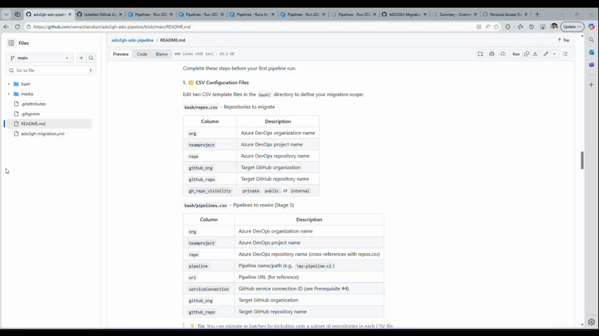

```bash
git clone https://dev.azure.com/<org>/<project>/_git/ado2gh-ado-pipelines
cd ado2gh-ado-pipelines
```

### Step 2: Configure the CSV files

Open `bash/repos.csv` and `bash/pipelines.csv` and add one row per repository /
pipeline you want to migrate. In the video these are edited in Excel, but any text
or spreadsheet editor works.

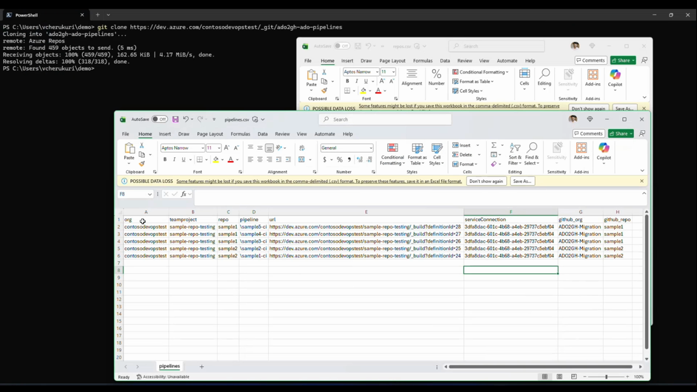

**`pipelines.csv` columns:** `org`, `teamproject`, `repo`, `pipeline`, `url`,
`serviceConnection`, `github_org`, `github_repo`.

> 💡 Leave the `serviceConnection` column empty for now — you will fill it in
> [Step 6](#step-6-copy-the-service-connection-id-into-pipelinescsv) after the
> service connection is created.

> ⚠️ If you edit in Excel, **keep the file in CSV format** when saving (dismiss the
> "POSSIBLE DATA LOSS" prompt by choosing to keep the `.csv` format).

### Step 3: Confirm the GitHub Apps are installed

In your **target GitHub organization**, open **Settings → Installed GitHub Apps**
(`https://github.com/organizations/<org>/settings/installations`).

Confirm that **Azure Boards** and **Azure Pipelines** are installed. These apps
provide the integration that the migration, pipeline-rewiring (Stage 5) and
boards-integration (Stage 6) stages rely on.

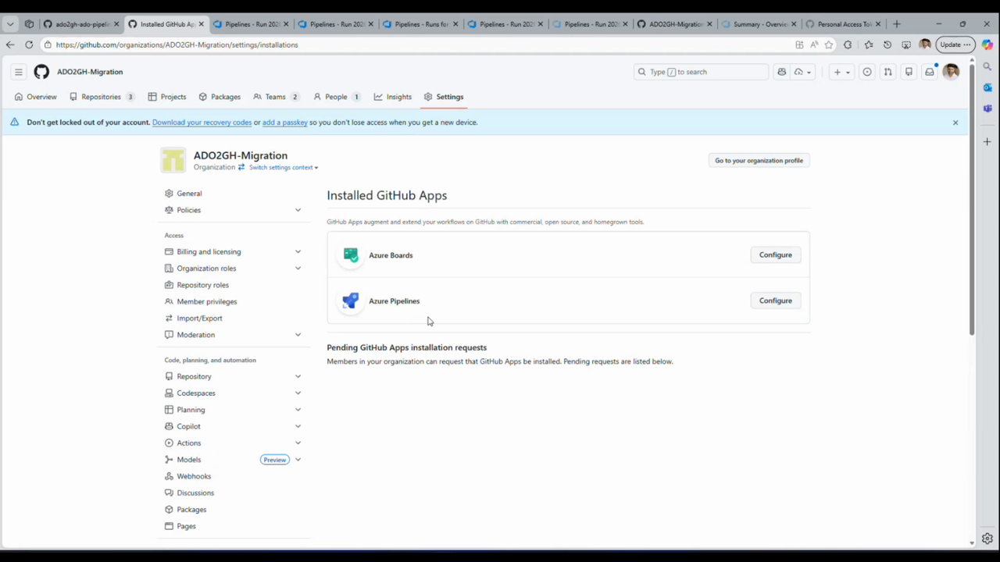

### Step 4: Create the GitHub service connection

Back in Azure DevOps, open **Project Settings**. Under the **Pipelines** group in the
left navigation you'll find **Service connections**.

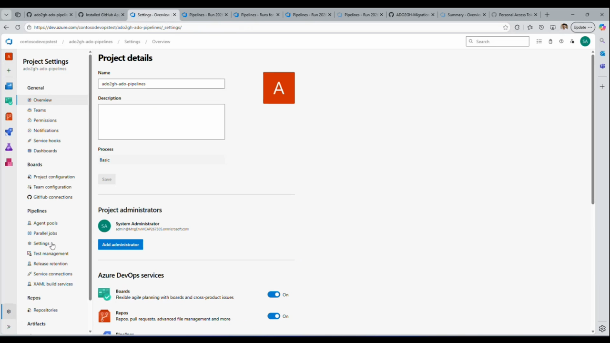

Click **New service connection → GitHub**. In the **New GitHub service connection**
panel:

1. Set **Authentication method** to **Grant authorization**.
2. Leave **OAuth Configuration** as **AzurePipelines**.
3. Click **Authorize**.

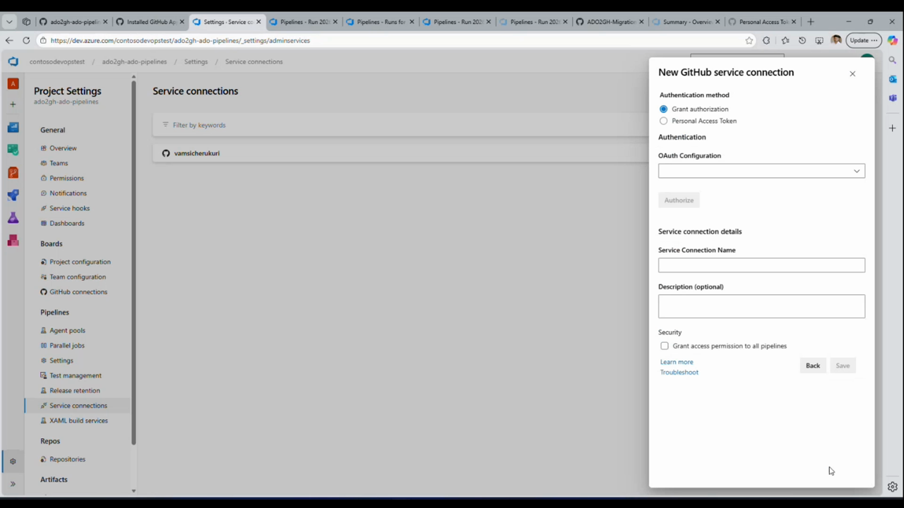

### Step 5: Authorize Azure Pipelines (OAuth)

A GitHub OAuth popup appears. Choose the GitHub account that has access to the
target organization and click **Continue** to authorize Azure Pipelines.

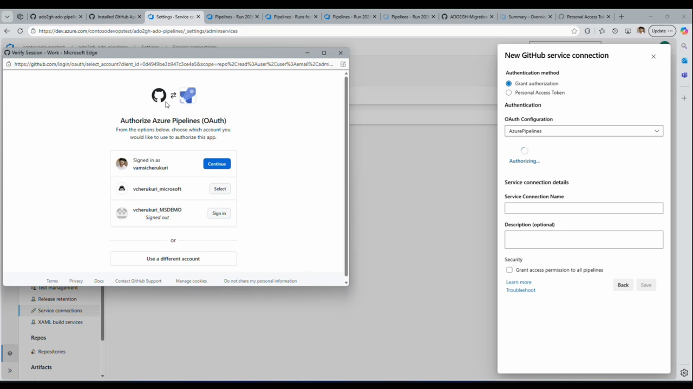

After authorizing, give the connection a **Service Connection Name**, optionally
check **Grant access permission to all pipelines**, and **Save**. The new connection
then appears in the Service connections list:

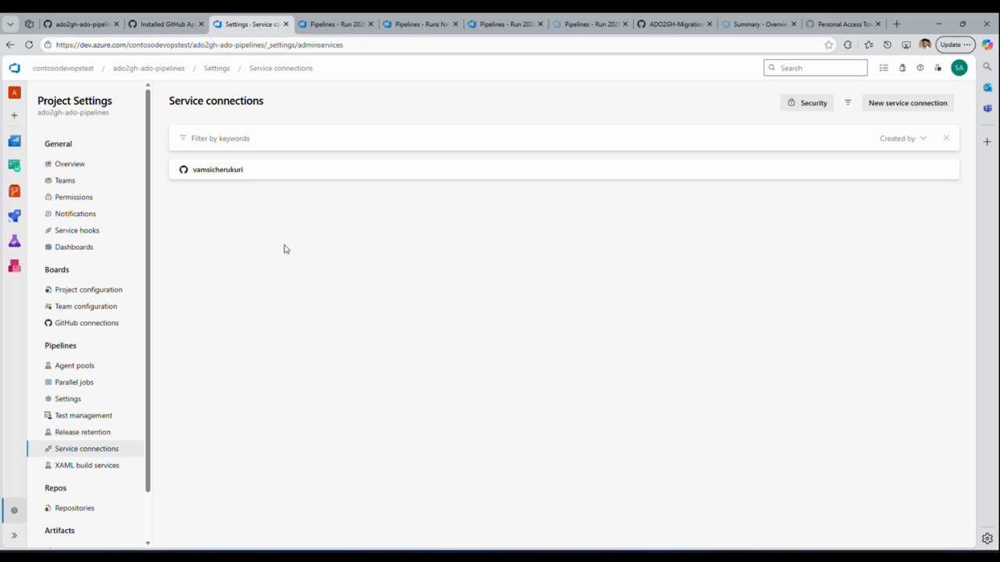

### Step 6: Copy the service connection ID into `pipelines.csv`

Open the saved service connection. Its **ID** (a GUID) is shown under the connection
name. Copy this GUID and paste it into the **`serviceConnection`** column for every
row in `bash/pipelines.csv`.

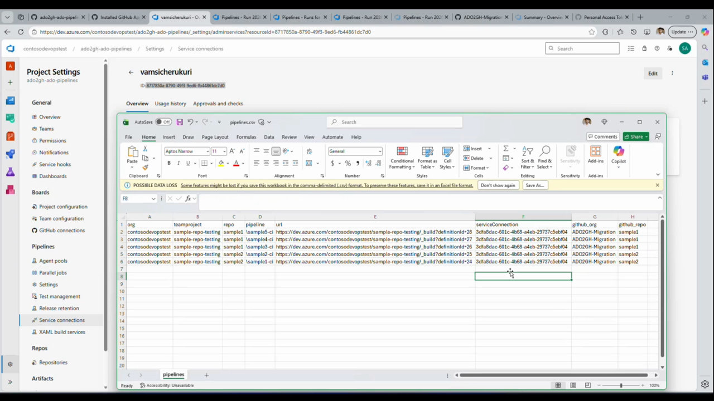

Commit and push your updated CSV files:

```bash
git add bash/repos.csv bash/pipelines.csv
git commit -m "Configure migration batch"
git push
```

> 🔐 **Also required before running** (see the [README prerequisites](./README.md#️-prerequisites)
> for full detail): create the **PAT tokens** (1 Azure DevOps + 2 GitHub) and store
> them in the two Azure DevOps **Variable Groups**
> (`core-entauto-github-migration-secrets` and `azure-boards-integration-secrets`).

---

## Part 2 — Running & Understanding the Pipeline

With setup complete, you can run the pipeline and follow its progress through the
six stages.

### Step 7: Start a pipeline run and set parameters

Go to **Pipelines**, select the migration pipeline, and click **Run pipeline**.
The run dialog lets you pick the **Branch/tag** and set the run **Parameters**:

- **Max Concurrent Migrations** — how many repositories migrate in parallel.
- **Advanced options** — **Variables**, **Stages to run**, and **Resources**.

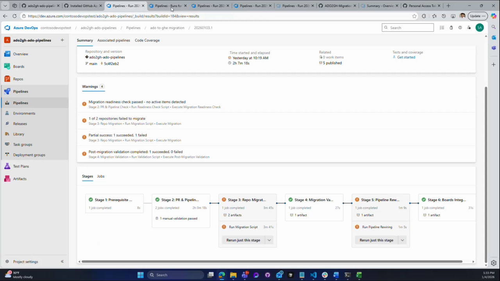

### Step 8: Demo / migration-only mode

Enable the **Demo Mode: Run Migration Only (Skip Stages 4-6)** parameter when you
only want to migrate and validate repositories without rewiring pipelines or
integrating Azure Boards. Then click **Run**.

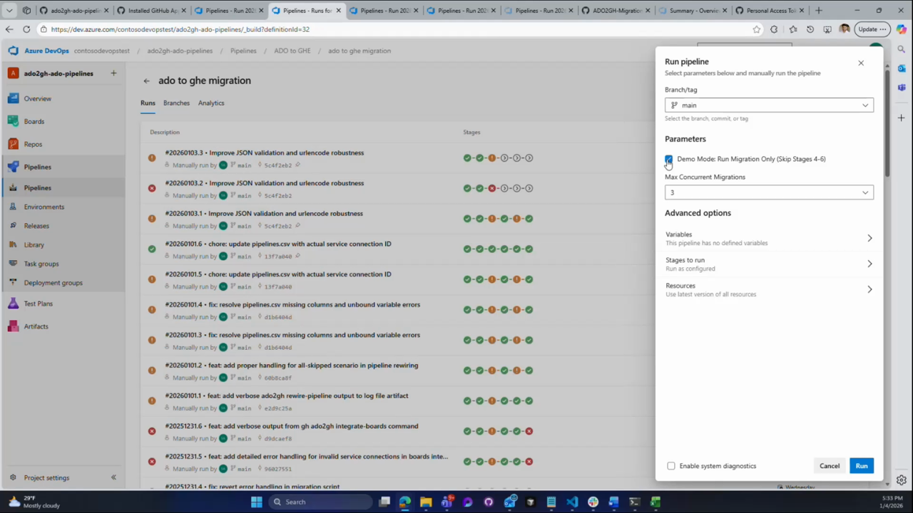

### Step 9: Monitor the six stages

The run **Summary** shows the staged flow and a **Warnings** panel that surfaces key
outcomes — readiness results, per-repository success/failure, and validation status.

The pipeline executes six sequential stages:

1. **Stage 1 — Prerequisite Validation**
2. **Stage 2 — PR & Pipeline Check** *(includes the manual approval / validation gate)*
3. **Stage 3 — Repository Migration**
4. **Stage 4 — Migration Validation**
5. **Stage 5 — Pipeline Rewiring**
6. **Stage 6 — Boards Integration**

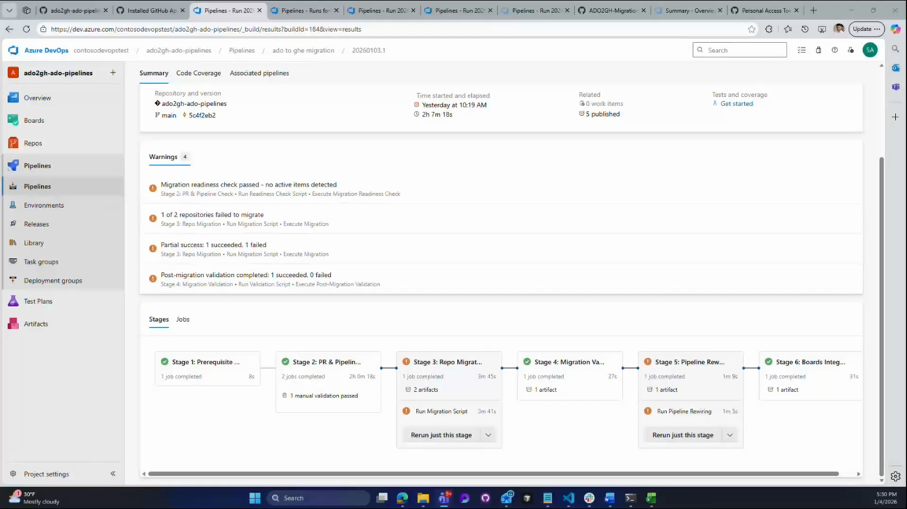

> 🔒 After Stage 2, the pipeline pauses at a **manual approval gate** (shown as
> "manual validation passed" once approved). Review the readiness report, then
> approve to continue to migration. Each stage records "job completed" and publishes
> its log artifacts. The summary also reports **partial success** — for example,
> "1 of 2 repositories failed to migrate" — so downstream stages only process the
> repositories that migrated successfully.

### Step 10: Review the published artifacts

Each stage publishes an artifact set. Open **Artifacts → Published** to browse them.
Notable items include the per-stage log folders (`migration-logs`, `validation-logs`,
`rewiring-logs`, `boards-integration-logs`) and `octoshift` log files.

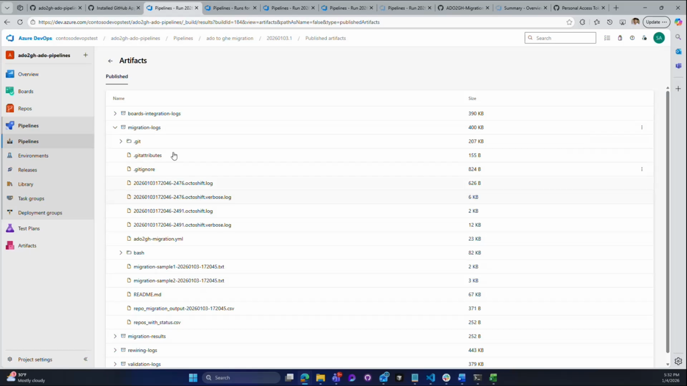

The **`repos_with_status.csv`** artifact tracks the success/failure of each
repository. Stages 4–6 consume this file so they run only against repositories that
migrated successfully.

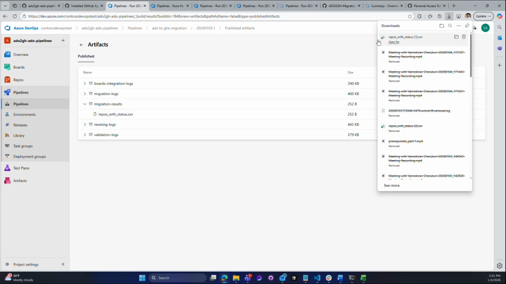

---

## ✅ Setup Checklist

| # | Task | Reference |
|---|------|-----------|
| 1 | Clone the pipeline repository | [Step 1](#step-1-clone-the-pipeline-repository) |
| 2 | Fill in `bash/repos.csv` and `bash/pipelines.csv` | [Step 2](#step-2-configure-the-csv-files) |
| 3 | Confirm **Azure Boards** + **Azure Pipelines** GitHub Apps installed | [Step 3](#step-3-confirm-the-github-apps-are-installed) |
| 4 | Create the GitHub **service connection** in Azure DevOps | [Step 4](#step-4-create-the-github-service-connection) |
| 5 | Authorize via **OAuth** and save the connection | [Step 5](#step-5-authorize-azure-pipelines-oauth) |
| 6 | Paste the **service connection ID** into `pipelines.csv`, commit & push | [Step 6](#step-6-copy-the-service-connection-id-into-pipelinescsv) |
| 7 | Create **PAT tokens** and **Variable Groups** | [README prerequisites](./README.md#️-prerequisites) |
| 8 | **Run the pipeline** and set parameters | [Step 7](#step-7-start-a-pipeline-run-and-set-parameters) |
| 9 | Approve the gate and **monitor the six stages** | [Step 9](#step-9-monitor-the-six-stages) |
| 10 | Review **artifacts** and `repos_with_status.csv` | [Step 10](#step-10-review-the-published-artifacts) |

---

📺 _Screenshots in this guide were captured from the walkthrough videos in
[`media/part 1.mp4`](./media/part%201.mp4) and [`media/part 2.mp4`](./media/part%202.mp4)._
